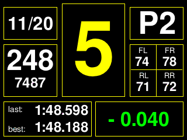
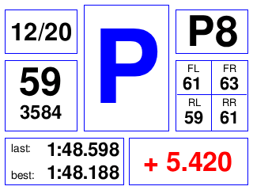
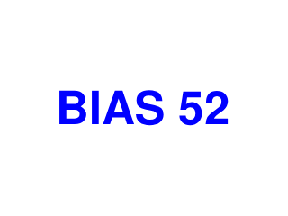

# ESP32 SimHub Dash for simracing (ILI9341 320×240 + WS2812)
**Status:** early prototype. Functional, changing fast.

---

## Features
Displays real-time telemetry (speed, RPM, gear, tyre temps, lap data, flags) from SimHub via CSV.
Features include: 
- LED rev bar
- pit limiter overlay with display inversion
- no-data and ignition-off screens
- a temporary brake bias overlay.
- full flag system for led bar

---

  

---

## Wiring schematic

  

---

## Hardware
- MCU: ESP32 | Any with RMT support |
- Display: ILI9341, 320×240, SPI | Hardware SPI |
- LEDs: WS2812 | Default 8 LED bar |

### Default Pins
- TFT_CS: 27 
- TFT_DC: 16
- TFT_RST: 4
- WS2812 DIN: 13

## Libraries
- `Adafruit_GFX`
- `Adafruit_ILI9341`
- `NeoPixelBus`

---

## Build & Flash
1. Select an ESP32 board in Arduino IDE.
2. Open the sketch, keep serial at **115200**.
3. Flash.

---

## Case & Mount (planned)
A custom **3D-printed case and mounting system** will come later.  
Once finalized, **STL and project files will be published** in this repo.

---

## To do
- fix CSV parser. Swap to fixed buffer + strtok_r:
- pin the LED task to core 0
- fix reverse gear displaying

## Known Issues (WIP)
- Reverse gear not showing
---

## layout

  

dash screen:

  

Pit limiter screen:

  

No data screen:

  

brake bias change temporary screen:

  

