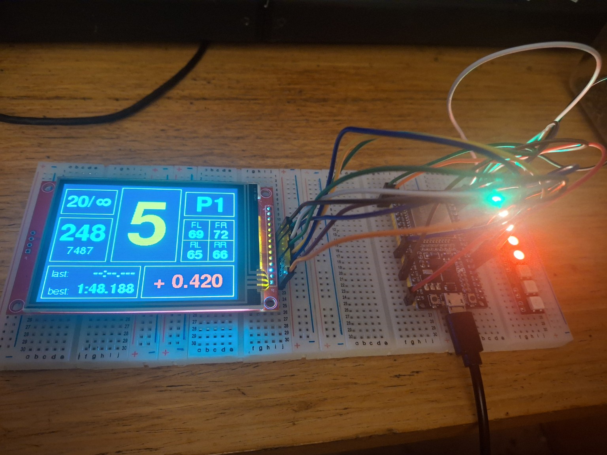

# ESP32 SimHub Dash for simracing (ILI9341 320×240 + WS2812)
**Status:** early prototype. Functional, changing fast.

ESP32 dashboard for SimHub telemetry. Renders RPM, speed, lap counter, gear, position, tyre temperatures, lap/best, and delta on an ILI9341. 
Drives an 8-LED shift bar via ESP32 RMT. Falls back to **NO DATA FEED** when input stops.

---

## Features
- RMT-driven WS2812 used as rev bar and flag display.
- 320x240 TFT display showing gear, rpm, speed, position, fuel, laptimes and delta.
- Delta readout with color coding. Green for gaining / red for losing time to reference.
- Flag override on LED bar (red, yellow, blue, green).
- No-data fail mode: big warning + LED end-blink.
- Easy pin/brightness/layout tuning in code.

---

  

## Hardware
- MCU: ESP32 | Any with RMT support |
- Display: ILI9341, 320×240, SPI | Hardware SPI |
- LEDs: WS2812 | Default 8 LED bar |

### Default Pins
- TFT_CS: 27 
- TFT_DC: 16
- TFT_RST: 4
- WS2812 DIN: 13

## Libraries
- `Adafruit_GFX`
- `Adafruit_ILI9341`
- `NeoPixelBus`

---

## Build & Flash
1. Select an ESP32 board in Arduino IDE.
2. Open the sketch, keep serial at **115200**.
3. Flash.

---

## Case & Mount (planned)
A custom **3D-printed case and mounting system** will come later.  
Once finalized, **STL and project files will be published** in this repo.

---

## Known Issues (WIP)
- Occasional LED lag if the serial feed is inconsistent.
- Layout and font baselines not final; subject to change.
- Delta vertical centering uses a small baseline fix.
- SimHub CSV sender must be configured manually.
- Refresh flickering

---

## License
MIT
